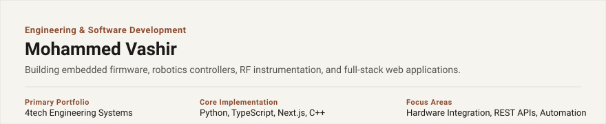
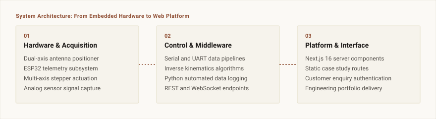

  

## Overview

I design and implement technical systems across embedded hardware, automated measurement, and web platforms. My work centers on building reliable software interfaces for physical devices, structured telemetry pipelines, and fast web applications.

Recent work includes an automated dual-axis antenna measurement system, custom stepper motor controllers for robotic arms, and a full-stack engineering portfolio with customer enquiry authentication.

 

  

 

## Selected Projects

### 4tech Engineering Platform
Full-stack engineering portfolio and customer enquiry portal.
- Statically generated project routes with Next.js 16 and TypeScript.
- Firebase integration for authenticated enquiry handling and customer management.
- Documentation for robotics, RF research, and hardware test rigs.
- Repository: [4tech-website](https://github.com/4techno/4tech-website)

### Automated Antenna Radiation Pattern Measurement System
Benchtop measurement architecture for characterizing directional antennas.
- Dual-axis stepper turntable controlled via serial commands.
- Python data acquisition pipeline logging RF power readings against angular position.
- Polar radiation plot generation with automated beamwidth calculation.

### Advanced Robotic Arm Systems
Articulated arm controller with inverse kinematics.
- Multi-axis stepper coordination through dedicated motor driver boards.
- Kinematic path planning executing smooth coordinate trajectories.
- Firmware safety limits and hardware calibration routines.

### AI Assistant & Tool Gateway
Local gateway and API orchestration client for model execution.
- Fast streaming interface for Claude and Gemini models.
- Tool-calling integration for terminal automation and local file operations.
- Token-aware caching to reduce latency on repeated queries.
- Repository: [ai-chat-assistant](https://github.com/4techno/ai-chat-assistant)

 

## Technical Competencies

### Embedded & Hardware Integration
- Languages: C, C++, Python
- Microcontrollers: ESP32, STM32, Arduino
- Protocols: UART, SPI, I2C, Serial over USB
- Instrumentation: Stepper drivers, RF power sensors, telemetry logging

### Software & Architecture
- Languages: Python, TypeScript, JavaScript
- Frameworks: Next.js, FastAPI, Flask, Node.js
- Databases: PostgreSQL, MongoDB, Firebase Firestore
- Tooling: Git, Docker, Linux, Shell scripting

 

## Contact

- Email: mohammedvashir75@gmail.com
- GitHub: [github.com/4techno](https://github.com/4techno)
- LinkedIn: [linkedin.com/in/mohammed-vashir](https://linkedin.com/in/mohammed-vashir)
